<div align="center">

# AgencityLab

**A scientific Python framework for implementing, testing, and exploring the Theory of Agencity.**

<p>
  
  
  
  
  <a href="https://github.com/Gilbert243/AgencityLab/actions/workflows/ci.yml">
    
  </a>
</p>

<p>
  <strong>Stable software core.</strong> Explicit scientific status. Reproducible numerical workflows.
</p>

</div>

---

## What AgencityLab is

AgencityLab is an open-source research software library built to make the Theory of Agencity **computable, testable, inspectable, and falsifiable**.

The library separates the accepted canonical mathematics from diagnostics and from experimental, research, and speculative extensions. A stable software API therefore does **not** imply empirical validation of every scientific layer.

At the center of the framework is the observable agencity flux

```text
b(t) = P_c(t) * beta(t)
```

computed through one reference scalar pipeline.

### At a glance

| Capability | Purpose | Scientific status |
| --- | --- | --- |
| `compute_agencity()` | Reference scalar end-to-end computation | canonical |
| `agencitylab.analysis` | Coherence, transitions, geometry, signatures | diagnostic |
| `agencitylab.api` | Stable workflows, batch, streaming, orchestration | software API |
| `agencitylab.reference` | Observable generators, datasets, reproducible scenarios | reference/test utility |
| `agencitylab.fields` | Observable spatial fields and autonomous field models | experimental / research |
| `agencitylab.thermodynamics` | Thermodynamic constructions | research |
| `agencitylab.gravity` | Classical gravity extensions | research |
| `agencitylab.quantum` | Quantum-field primitives | speculative |
| `agencitylab.applications.cosmology` | Homogeneous cosmology extensions | speculative |

---

## Installation

The canonical engine and stable public API require only NumPy:

```bash
pip install agencitylab
```

Optional capabilities are isolated in extras:

```bash
pip install "agencitylab[scientific]"
pip install "agencitylab[data,viz]"
pip install "agencitylab[numba]"
pip install "agencitylab[jax]"
```

AgencityLab 1.0 supports **CPython 3.10 through 3.14** and ships PEP 561 typing metadata via `py.typed`.

---

## Quickstart

```python
import numpy as np
import agencitylab as al

xi = np.linspace(0.0, 20.0, 801)
u = np.sin(xi)

result = al.compute_agencity(
    u,
    xi,
    A_ref=1.0,
    tau=2.0,
    w=1.5,
    P_c=5.0,
)

print(result.b)
```

`compute_agencity()` is the sole reference canonical end-to-end scalar pipeline.

The physical/contextual inputs `A_ref`, `tau`, `w`, and `P_c` remain explicit. They are not inferred silently from signal statistics. If `w` is omitted, the implementation fallback `w = tau` is recorded as an implementation choice, not presented as a universal theoretical identity.

---

## Canonical computation

```mermaid
flowchart LR
    U[Observable u] --> US[Normalized u*]
    US --> X[Activation X*]
    X --> A[Activity A*]
    A --> CRM[CRM memory]
    CRM --> MO[M, O]
    MO --> DS[D, S]
    DS --> JT[J, Theta]
    JT --> BETA[beta]
    BETA --> B[b = P_c beta]

    B --> ANALYSIS[Diagnostics and interpretation]

    classDef canonical fill:#eef6ff,stroke:#3776ab,stroke-width:1px;
    classDef diagnostic fill:#f7f7f7,stroke:#777,stroke-width:1px,stroke-dasharray: 4 3;
    class U,US,X,A,CRM,MO,DS,JT,BETA,B canonical;
    class ANALYSIS diagnostic;
```



The canonical identities include

```text
S = sqrt(M^2 + O^2)
Theta = atan2(O, M)
J = ln((e + D) / (e + S)),  e = exp(1)
```

For `S > 0`:

```text
U = (M + i O) / S
beta = J * U
b = P_c * beta
```

For `S = 0`, the canonical convention is explicit:

```text
U = 0
beta = 0
```

No arbitrary epsilon is inserted into these valid physical equations.

---

## Public API

AgencityLab keeps the package root intentionally small and exposes specialized science through explicit namespaces.

```python
import agencitylab as al

result = al.compute_agencity(...)
analysis = al.analysis.analyze_agencity(result)
field = al.fields.compute_agencity_field(...)
signal = al.reference.signals.sinusoid()
```

See [`docs/api_map.md`](docs/api_map.md) for the complete navigation map and [`docs/stable_api.md`](docs/stable_api.md) for the stable 1.0 contract.

---

## Results, diagnostics, and reproducibility

`AgencityResult` contains the canonical computation result together with reproducibility metadata.

Diagnostic analyses, multiscale products, signatures, reports, and figures are separate workflow artifacts rather than mutable fields on the canonical result object. This keeps interpretation from silently changing the mathematical result.

Result serialization uses schema `1.0`. Optional pandas and xarray adapters are available through:

```python
result.to_dataframe()
result.to_xarray()
```

when the `data` extra is installed.

---

## Spatial and autonomous fields

The observable field extension applies the canonical temporal pipeline independently at each spatial location:

```python
field = al.fields.compute_agencity_field(...)
```

with outputs such as

```text
beta_obs(x, t)
b_obs(x, t)
```

This extension remains **experimental**.

Promotion from observable agencity to the autonomous field is explicit:

```text
phi = sqrt(P_c * tau) * beta_obs
```

`beta_obs` and `phi` are distinct scientific objects and are never silently merged or renamed.

Classical field equations, quartic potentials, coherent structures, and field topology remain **research**. Gravity retains its Chapter-19 `(-,+,+,+)` convention while flat Chapter-16 field dynamics retain `(+,-,-,-)`; those signatures are not silently unified.

---

## Scientific status is part of the API

AgencityLab deliberately distinguishes software maturity from scientific status.

| Status | Meaning |
| --- | --- |
| **canonical** | Accepted scalar Theory pipeline and identities |
| **diagnostic** | Interpretation layered on canonical outputs |
| **experimental** | Numerical or orchestration extensions not promoted to canonical theory |
| **research** | Autonomous field, coherent, thermodynamic, and gravity models |
| **speculative** | Quantum/agenton and cosmological extensions |

A non-zero `beta` is **not** by itself evidence of coherent or “real” agencity. Diagnostics consume canonical outputs; they do not redefine them.

---

## Design principles

AgencityLab is developed around a few strict rules:

- **Theory before implementation** — code must express accepted definitions rather than modify them to obtain convenient numerical behavior.
- **Canonical before diagnostic** — interpretation lives outside the canonical engine.
- **Physical inputs remain physical** — `A_ref`, `tau`, `w`, and `P_c` are not silently replaced by signal statistics.
- **Numerical safety is not physics** — machine safeguards must not alter valid canonical equations.
- **Unexpected results are useful** — experiments are allowed to challenge the theory rather than being tuned to confirm it.

---

## Project structure

```text
agencitylab/
├── core/            canonical mathematical engine
├── analysis/        diagnostics and interpretation
├── api/             stable user-facing orchestration
├── models/          results and reproducibility metadata
├── reference/       signals, datasets and scientific scenarios
├── fields/          experimental and research field extensions
├── thermodynamics/  research thermodynamic layer
├── gravity/         research gravity layer
└── quantum/         speculative quantum primitives
```

The canonical engine remains deterministic, testable, and free of plotting or domain-specific interpretation.

---

## Quality gates

The 1.0 CI contract checks:

- Python 3.10, 3.11, 3.12, 3.13, and 3.14;
- the declared minimum NumPy core stack;
- public API typing;
- Ruff correctness and warning audits;
- test coverage measurement;
- wheel and sdist clean installation;
- optional extras in isolation;
- documentation with Sphinx warnings treated as errors;
- critical user examples;
- reproducible numerical-equivalence benchmarks.

The first stable 1.0 consolidation passed the retained scientific-equivalence benchmark without changing the accepted canonical equations.

---

## Development

```bash
python -m pip install -e ".[dev,docs]"
ruff check agencitylab tests benchmarks/performance examples
mypy --follow-imports=skip agencitylab/api/compute.py agencitylab/models/result.py
python -m pytest
sphinx-build -W --keep-going -b html docs docs/_build/html
python -m build
```

See [`CONTRIBUTING.md`](CONTRIBUTING.md), [`SUPPORT.md`](SUPPORT.md), and [`RELEASING.md`](RELEASING.md) for contribution, support, and release policies.

---

## Citation

Scientific users should cite the project using [`CITATION.cff`](CITATION.cff).

If you use AgencityLab in published research, please report the software version, the physical/contextual parameters used, and enough numerical metadata to reproduce the computation.

---

## License

AgencityLab is distributed under the [MIT License](LICENSE).
